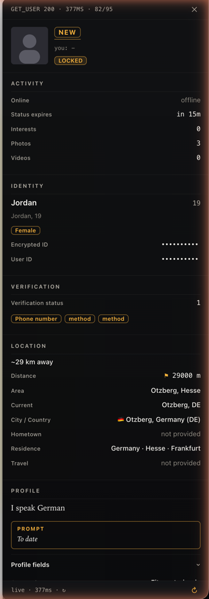

# Bumble's Paywall is a Joke - A Chrome Extension to See Who's Already Liked You 👀

<p align="center">
  
</p>

You're not ugly, you're just inefficient.

I was riding the high from dismantling Hinge's API and decided to take a peek at Bumble. I was wondering why my match queue felt like a graveyard. Turns out, Bumble's biggest feature, the "Beeline" (where they show you everyone who's already swiped right on you), isn't protected by some server-side fortress. It's literally just hidden with CSS.

They send the data directly to your browser and then charge you money to see it. Let that sink in.

### The WTF Moment: They Send You The `their_vote` Variable 🤦

I'm not even joking.

When your browser requests the list of potential matches, the response from Bumble's server includes a beautiful little key for each user: `their_vote`.

* `their_vote: 2` means they already swiped right on you. ❤️
* `their_vote: 3` means they swiped left. 💔
* `their_vote: 1` means they haven't seen you yet. 🤷

They send you the answer key and then ask you to pay to reveal it. This is not a hack. This is just reading the data they willingly give you. It took more time to write the `manifest.json` than to find the vulnerability.

### The Other WTF: Their "Request Signature" is a Hardcoded MD5 Salt 🧂🤡

So then I looked at how they "sign" requests. Every API call carries an `X-Pingback` header that's supposed to prove the request is legit. You ready for what it actually is?

```
X-Pingback = md5(requestBody + "whitetelevisionbulbelectionroofhorseflying")
```

That's the whole "signature." An MD5 of the body plus **one static salt string that ships, in plaintext, inside the JavaScript they hand to every single browser on Earth.** Open dev tools, search their bundle, there it is. Same salt for everyone, every session, never rotated. Yes, the salt is `whitetelevisionbulbelectionroofhorseflying`. No, I'm not making that up.

A secret you mail to eight billion people is not a secret — it's a decoration. This authenticates nothing and stops no one; the only thing it defends against is someone who hasn't pressed Ctrl-F. It's the security equivalent of taping a "DO NOT ENTER" sign across an open doorway.

To Bumble: if you want request integrity, that's what HMAC with a *server-side* key, nonces, and replay protection are for. A salt baked into the client is not a signature. (Still open to that freelance consulting gig. 🤙)

### The Strategic Advantage (aka Why Pay for Bumble Premium?) 🏆

Bumble wants you to swipe blindly, wasting your time on people who may have already rejected you. This extension kills that. It gives you back the power by revealing who has *already liked you* directly on their profile card as you're swiping.

1.  **Guaranteed Matches:** See that green "[LIKED YOU] ❤️" badge? Swipe right. Boom. Instant match. You can spend your entire session only swiping on guaranteed connections.
2.  ~~**Dodge the Rejection:** See a red "[REJECTED YOU] 💔" badge? You can swipe left and save yourself the emotional damage. Or swipe right for the story. You do you.~~
3.  **Stop Wasting Time:** No more guessing games. You can now allocate your swipes with god-tier precision.

### Disclaimer 🙏

This is for educational purposes. It demonstrates how some companies implement "premium" features. Don't be a weirdo. Don't use this to harass people. I am not responsible if you get banned, get your heart broken, or end up on a date with your second cousin twice removed.

To Bumble: If you're gonna C&D this, at least fix your API. Don't send the data to the client if you want people to pay for it. Also, I'm open to freelance security consulting. Call me. 🤙

### How It Works 🔥

Still embarrassingly simple at the core — two content scripts, now written as TypeScript modules in `src/` and bundled with [Bun](https://bun.sh) to `dist/page.js` + `dist/content.js`:

* **`page.js`** (`world: "MAIN"`, `document_start`): patches `fetch` / `XMLHttpRequest`, and when it sees the `SERVER_GET_ENCOUNTERS` call it grabs the results.
* **`content.js`** (isolated world): reads the on-screen profile, cross-references the intercepted data, and injects the color-coded badge.

**The dossier — the spicy part 🌶️:** click the badge (or hit `Cmd/Ctrl+D`) and it fires *one* signed `SERVER_GET_USER` request — yes, using that hardcoded salt I just roasted — to pull **every** field Bumble has on that profile into a panel over the card: their hidden `profile_score_numeric` (a 0–1000 hotness score they never show you), prompts, verification, languages, distance, the lot. They reverse-engineered their own paywall for me; I just asked nicely with the right header.

### Setup & Usage

**Just run it:** grab the latest `.zip` from [Releases](../../releases), unzip, then `chrome://extensions` → flick on **Developer mode** → **Load unpacked** → pick the folder. (Or clone and load-unpacked the repo root — `dist/` is committed, so no build step required.)

**Hacking on it:** [Bun](https://bun.sh) toolchain.

```bash
bun install
bun run build      # src/ -> dist/{page,content}.js
bun run dev        # watch + sourcemaps + console logging
bun test           # md5 / pingback / cache unit tests
bun run typecheck
```

Then `chrome://extensions` → Load unpacked → the repo root. Go to `bumble.com/app` and start swiping — liked-you profiles light up, and the badge opens the full dossier.

### What it won't do 🙅

This stays a *read-only* tool — it shows you what Bumble already told your browser, nothing more. On purpose, it does **not**:

* **Auto-swipe / mass-like.** Programmatically voting is account automation: a straight ToS violation and ban-bait. Click your own likes.
* **Locate or de-anonymize anyone.** The payload carries distance and other signals; using them to triangulate someone's location or surface who-blocked-you is stalking, not "reading your own data." Hard no.

### To-Do (Because Why Stop Here?)

* [x] Keep a local history of everyone you've seen — a personal burn book — so badges survive a reload (persisted via `chrome.storage.local`).
* [x] Show *all* the fields Bumble sends per profile, in a dossier panel on the card (click the badge).

Go find love. I'm not your dad.